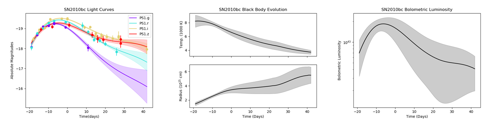

# Summary

When analyzing a supernova, or any other transient event, a key piece of information is the total amount of energy released as electromagnetic radiation as a function of time. This is captured by the bolometric light curve, and the calculation of this bolometric light curve is often the first step of any supernova study [@arnett1980analytic]. If one can obtain a sufficiently broad and detailed spectrum, the bolometric luminosity can be directly calculated by integrating over all wavelengths. Unfortunately, such data is not typically available. Instead, data typically takes the form of broadband photometry, sampled at discrete wavelengths. The main goal of `extrabol` is to estimate the bolometric luminosity of supernovae using sparsely sampled data. It does this in 3 main steps:

1. Read in and pre-process a data file holding observations of a supernova or other transient event over time, through any number of broadband filters.

2. Interpolate this data using a Gaussian Process(GP), a non-physical, statistical model utilizing covariance.

3. Fit a series of blackbody curves to the interpolated data to estimate the bolometric luminosity, temperature, and radius of the transient over time.

The user must provide a data file including observational times, magnitudes, uncertainties and filters used to conduct the observation. Each filter must have a corresponding ID in the Spanish Virtual Observatory (SVO, @gutierrez2006spanish). After reading in all data from a user-generated text file, `extrabol` corrects for redshift and extinction due to galactic dust using the extinction model presented in @fitzpatrick2007analysis. The user may also optionally correct the light curve for host galaxy reddening. The apparent magnitudes are converted to a logarithmic luminosity. Data points are also culled based on a minimum signal-to-noise ratio and a desired temporal window specified by the user.

Once the light curve has been pre-processed, a 2-D GP is fit to the observed data, using the open-source code `george` [@foreman2015george]. The GP uses the standard squared exponential kernel, interpolating in both time and wavelength (using the effective wavelengths of each filter from SVO). The GP kernel parameters are optimized via the `scipy` `minimize` function [@virtanen2020scipy], which uses a gradient descent optimizer. In the presence of large temporal gaps between data points, it is possible that the GP will yield an unrealistic interpolation near the mean function. For this reason, we additionally provide a series of SN templates to optionally use as GP mean functions. Specifically, the user may select from a set of Type Ia, Type Ib/c, Type IIL and Type IIP templates originally provided in @nugent_2007. 

With a densely sampled interpolation, `extrabol` finally fits a series of blackbodies to the light curves, giving estimates of the bolometric luminosity, radius, and temperature over time. The user can specify whether a gradient descent method (using `scipy` `curve_fit`) or a Markov Chain Monte Carlo (`emcee`, @foreman2019emcee) is used in this step. While the gradient descent option is significantly quicker, a Markov Chain Monte Carlo may be desirable for better error estimates. 

Finally, `extrabol` produces several output files. We provide the blackbody temperature, radius and luminosity as a function of time. We additionally provide plots for quick analysis. \autoref{fig:example} below shows an example of three output plots from extrabol.

{width = 150%}

# Statement of need

The discovery rate of supernovae has grown exponentially since the 1980s. Currently, about 20,000 supernovae are observed every year. In 2024, the Vera Rubin Observatory is expected to begin its decade-long Legacy Survey of Space and Time (LSST) which will increase supernovae observations by over two orders of magnitude [@abell2009lsst].

Such an increase in data generates a need for new, more efficient tools to process said data. Furthermore, open access tools greatly lowers the barriers to analysis of LSST data. This was the motivation behind `extrabol`. `extrabol` is designed to allow users to quickly and automatically generate the bolometric light curves (under blackbody assumptions) of supernovae, enabling rapid, quantitative analysis of multi-band light curves with minimal preprocessing steps on the user’s end.

Although creating a bolometric light curve is often the very first step of analysis for supernovae, limited options exist for scientists. The closest counterpart to `extrabol` is `superBol` [@nicholl2018superbol], a Python-based package which also computed bolometric light curves from broadband observations. Unlike `extrabol`, `superbol` uses deterministic interpolation methods (e.g., polynomial fits) and requires a degree of user interactivity in order to fit each object. `extrabol`, in contrast, interpolates using a 2-D GP and can be run with no user interaction, allowing for automation over large batches of data. For example, SN 2010bc shown in \autoref{fig:example} contains 267 data points and takes just under 3 seconds to run on one CPU. If an object of interest is found, `extrabol` also retains the flexibility to conform to unique cases with 16 optional arguments that the user is free to adjust as necessary.

# Acknowledgements
This work was generously supported by LSSTC through an Enabling Science Award (# 2021-08). 

# References

